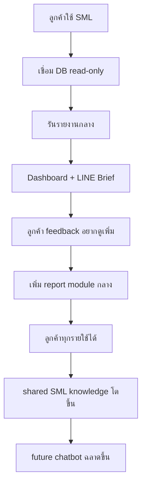

# Product Blueprint: AI Business Command Center for SML

## เป้าหมายของเอกสาร

นิยาม product, target customer, subscription model, phase roadmap และขอบเขตที่ชัดเจนสำหรับระบบ **AI Business Command Center for SML**

## Product Vision

สร้างระบบรายเดือนสำหรับลูกค้า SML ที่ช่วยให้ผู้บริหารเห็นรายงานสำคัญทุกวันโดยไม่ต้องเปิด SML หรือรอคนดึงรายงาน

ระบบเริ่มจาก:

- Dashboard จากรายงาน SML PostgreSQL ที่ approved แล้ว
- LINE OA Morning Brief ทุกเช้า
- Report library ที่ใช้ร่วมกันทุกลูกค้า

อนาคตต่อยอดเป็น:

- Chatbot ถามข้อมูลจากรายงานที่ approved แล้ว
- AI Business Copilot ที่ช่วยสรุป anomaly, insight, recommendation

## One-Line Pitch

ระบบผู้ช่วยผู้บริหารสำหรับ SML ที่เชื่อม PostgreSQL แบบ read-only แล้วแสดง Dashboard และส่ง LINE Morning Brief ทุกเช้า พร้อมต่อยอดเป็น chatbot ที่ตอบจากรายงานที่ตรวจสอบได้

## Core Positioning

ระบบนี้ไม่ใช่ BI ทั่วไป และไม่ใช่ chatbot ถาม database ตรง ๆ แต่เป็น **SML Report Intelligence Platform**

```text
SML PostgreSQL
  -> Approved SQL Reports
  -> Metric Snapshots
  -> Dashboard / LINE OA / Future Chatbot
```

## Target Customer

- ร้าน/บริษัทที่ใช้ SML PostgreSQL
- บริษัทที่มีเจ้าของหรือผู้จัดการต้องดูยอดขายทุกวัน
- ธุรกิจค้าปลีก/ค้าส่ง/หลายสาขา
- ธุรกิจที่มีรายงาน SML อยู่แล้ว แต่ยังต้องดึงเอง
- ลูกค้าที่ต้องการเริ่มจาก dashboard และ LINE ก่อน ยังไม่พร้อม chatbot เต็มระบบ

## Subscription Model

หลักคิด:

```text
report logic / SML knowledge = shared
customer data / DB connection / LINE target = separated per tenant
```

### Suggested Packages

#### Starter

- 1 company / 1 database
- Sales dashboard
- LINE Morning Brief 1 target
- Daily scheduled refresh
- Basic report run history

#### Business

- Multiple report modules
- Sales by branch/product/customer
- AR, inventory, SO backlog in future
- Multiple LINE targets
- Role/branch permission
- Export report

#### Pro / Enterprise

- LINE/Web chatbot over approved reports
- Custom report mapping
- Private deployment or VPN/Tailscale connection
- SLA/support
- Advanced audit and anomaly alerts

## Value Proposition

สำหรับลูกค้า:

- ได้รายงานทุกเช้าโดยไม่ต้องเปิด SML
- ลดเวลารอคนสรุปรายงาน
- เห็นยอดขาย/สาขา/สินค้าแบบเร็ว
- เริ่มจากข้อมูลจริงและรายงานที่ตรวจสอบได้

สำหรับ product:

- รายงานหนึ่งตัวขายซ้ำได้หลาย tenant
- feedback จากลูกค้าแต่ละรายเพิ่มคุณค่าให้ shared SML knowledge
- ต่อ chatbot ได้โดยไม่เสี่ยงให้ AI เดา SQL

## Phase 1 Scope

ทำ:

- Tenant เดียวสำหรับ pilot
- Connect SML PostgreSQL แบบ read-only
- Report แรก: sales by branch/product จาก query ที่เจ้าของระบบส่งให้
- Dashboard หน้าแรก
- LINE OA Morning Brief ทุก 08:00 หรือเวลาที่ config
- Report run history และ error log

ยังไม่ทำ:

- Chatbot
- AI forecast/recommendation
- Write-back เข้า SML
- Multi-company complex permission
- Mobile native app
- OpenHuman desktop fork

## Future Scope

- เพิ่ม report library: AR overdue, inventory risk, SO backlog, top products
- Multi-tenant subscription admin
- LINE Q&A และ Web Chat
- Role-based chatbot
- AI insight/anomaly detection
- On-prem/local connector option

## Product Loop



## Explicit Assumptions

- ลูกค้า SML ส่วนใหญ่มี schema เหมือนกันหรือใกล้เคียงกันมาก
- 1 บริษัทใช้ 1 database เป็น baseline
- บางร้านมี `branch_code` บางร้านไม่มี ต้องรองรับทั้งสองแบบ
- Phase 1 deploy บนเครื่องทดสอบก่อน แล้วค่อย harden สำหรับ production

