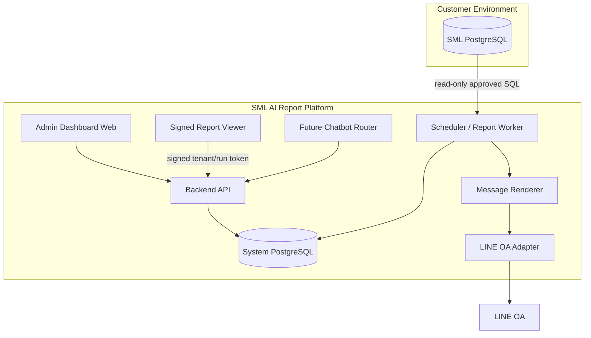

# System Architecture

## เป้าหมายของเอกสาร

อธิบาย architecture production-grade สำหรับระบบ SML AI Business Command Center ตั้งแต่ frontend, backend, worker, system database, SML datasource, LINE OA และ future chatbot

## Architecture Overview



## Main Subsystems

### Frontend Dashboard

หน้าที่:

- Admin tenant context
- แสดง KPI จาก `report_snapshots`
- ดูตาราง report result จาก `report_runs`
- filter date/branch/product
- ดู run history และ error state
- ตั้งค่า LINE schedule/readiness
- trigger mutation ผ่าน admin token ใน MVP

Phase 1 UI:

- `/command-center`: admin control room
- `/command-center/settings`: readiness/control panel
- `/command-center/brief`: customer-facing signed report viewer ไม่มี admin shell
- Data trust label: `พร้อมใช้`, `ควรตรวจยอด`, `ไม่มีข้อมูล`, `ข้อมูลเก่า`

### Backend API

หน้าที่:

- Auth/session ในอนาคต, ตอนนี้มี MVP admin mutation token
- Tenant and datasource config
- Report catalog API
- Dashboard data API
- Trigger report run manually
- Read run history/audit log
- Validate signed report viewer token
- Prepare/download server-side PDF export with signed viewer token, cache in `/app/.data/pdf-cache`
- Future chatbot API

API ต้องไม่ expose DB credential ออกไป frontend

### Worker / Scheduler

หน้าที่:

- รัน scheduled reports
- เชื่อม SML PostgreSQL
- validate params
- execute approved SQL only
- save `report_runs`
- build `report_snapshots`
- call message renderer
- send LINE OA
- retry failed jobs

### System Database

เก็บ metadata ของ platform ไม่ใช่ data SML raw ทั้งหมด

เก็บ:

- tenant config
- datasource encrypted secrets
- report definitions
- report run metadata
- report result/snapshot JSON
- LINE channel config
- audit log
- subscription status

### SML PostgreSQL Datasource

ข้อกำหนด:

- ใช้ read-only DB user
- query timeout
- allowlist เฉพาะ approved SQL
- ไม่ write-back
- ไม่ใช้ production superuser

### LINE OA Adapter

ออกแบบเป็น adapter เพื่อให้อนาคตเพิ่ม Email/Slack/Webhook ได้

```text
Report Snapshot
  -> Message Renderer
  -> Channel Adapter
  -> LINE OA / Email / Webhook
```

### Future Chatbot Layer

Chatbot ไม่ยิง SQL เอง แต่ทำงานแบบ router:

```text
question
  -> intent detection
  -> choose approved report
  -> fill parameters
  -> run/read report
  -> summarize answer
  -> cite report_run_id
```

## Deployment Modes

### Phase 1: Test Machine

```text
192.168.2.109
  - web
  - api
  - worker
  - system postgres
  - redis optional

SML DB
  - accessible over LAN/IP
```

### Production Option A: Direct DB over IP

เหมาะกับเริ่มเร็ว แต่ต้องมี:

- IP allowlist
- strong password
- read-only user
- SSL if possible
- firewall rule

### Production Option B: VPN/Tailscale/WireGuard

เหมาะกว่า direct public DB

### Production Option C: Local Connector Agent

ติดตั้ง agent ในฝั่งลูกค้าแล้วให้ agent pull/report result กลับ cloud เหมาะกับลูกค้าที่ไม่เปิด DB ออก internet

## Explicit Defaults

- Phase 1 ใช้ web-first platform ไม่ใช้ desktop OpenHuman
- Dashboard และ LINE อ่านจาก snapshot/run ที่ trace ได้
- ใช้ `tenant_id` ทุก table ที่เกี่ยวกับ customer data
- `report_definitions` เป็น shared knowledge กลาง
