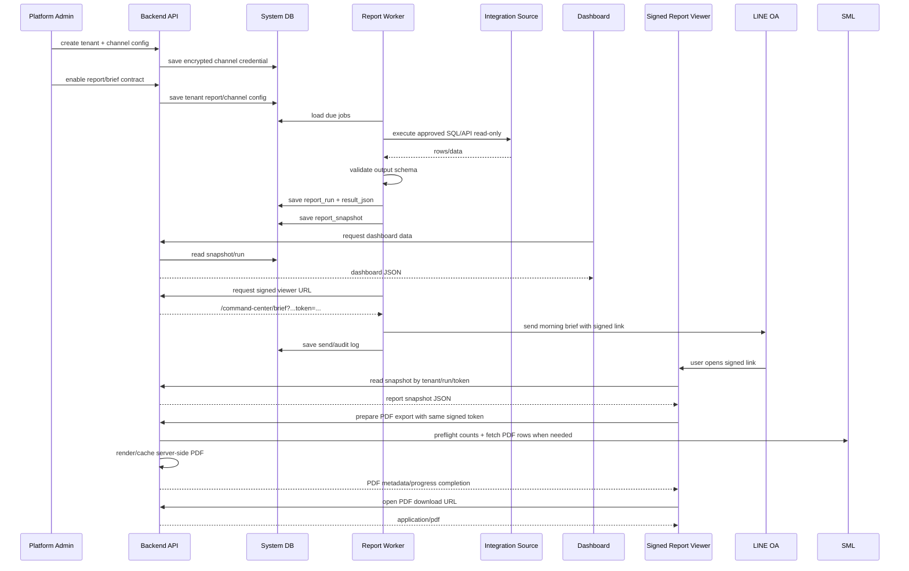
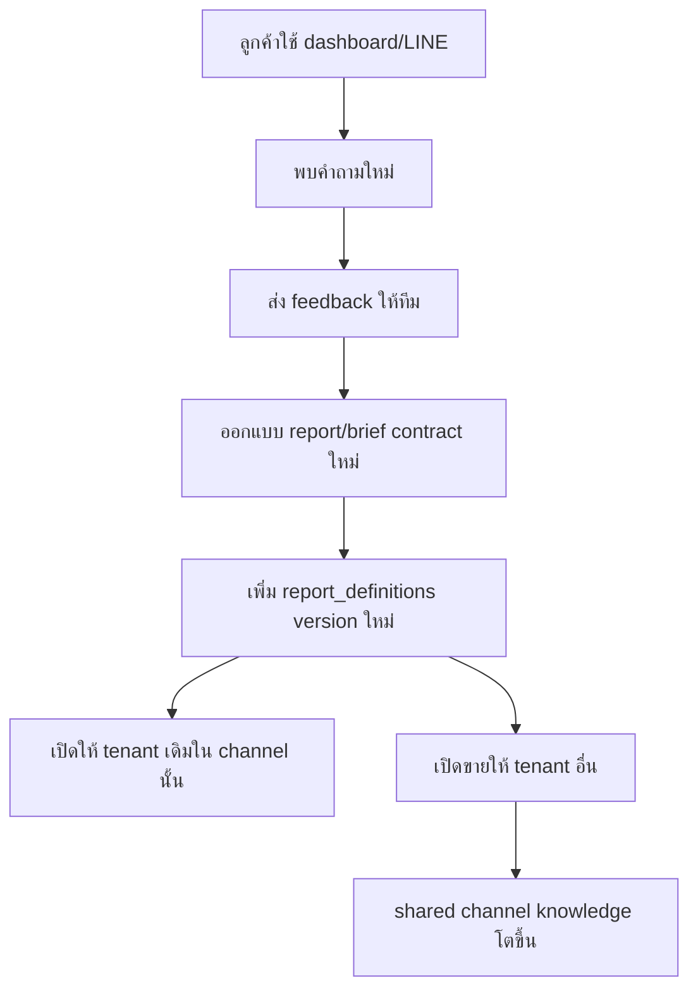

# Data Flow

## เป้าหมายของเอกสาร

อธิบาย full loop ของข้อมูลตั้งแต่ onboarding tenant, connect integration channel, run report/brief, build snapshot, dashboard, LINE Morning Brief, audit และ feedback loop กลับเข้า shared report/brief library

## Brief Channel Rule

AI-Business เป็น multi-channel brief hub:

- `sml_reports`: SML PostgreSQL approved SQL reports
- `flowaccount_finance`: FlowAccount OpenAPI finance/accounting brief foundation
- future channels เช่น `ecommerce`, `pos`, `crm`

แต่ละ channel แยก credential, permission, runner, schedule, template และ audit. ห้าม assume ว่า FlowAccount ต้องอ่าน/เขียน/เทียบกับ SML เว้นแต่มี requirement แยก.

## Full Loop



## Tenant Onboarding Flow

1. สร้าง `tenant`
2. เพิ่ม channel config เช่น SML datasource หรือ FlowAccount OAuth connection
3. ทดสอบ connection ของ channel นั้น
4. scan schema/fingerprint หรืออ่าน profile เท่าที่ channel รองรับ
5. enable report/brief ที่ต้องใช้
6. ตั้ง schedule
7. ตั้ง LINE target
8. run manual ครั้งแรก
9. ตรวจ dashboard และตัวเลขกับลูกค้า
10. เปิด scheduled job

## Report Run Flow

```text
input:
  tenant_id
  report_key
  params

steps:
  1. validate tenant active
  2. validate subscription allows report
  3. load channel config/datasource
  4. decrypt secret in memory only
  5. validate params
  6. render approved SQL/API request
  7. execute with timeout/rate-limit handling
  8. validate output schema
  9. save report_run
  10. build report_snapshot
  11. write audit log
```

## Dashboard Data Flow

Dashboard ไม่ควรรัน SML query โดยตรงทุก request

Preferred:

```text
Dashboard
  -> Backend API
  -> report_snapshots / report_runs
```

Manual refresh:

```text
Dashboard
  -> API trigger report run with x-ai-bcc-admin-token
  -> Worker run query
  -> save new snapshot
  -> Dashboard reload
```

## LINE Morning Brief Flow

```text
08:00 Asia/Bangkok
  -> scheduler selects active tenant reports
  -> derive period = yesterday
  -> check duplicate delivery key
  -> run approved report
  -> save report_run + report_snapshot
  -> generate signed report viewer URL
  -> render message from snapshot summary
  -> send LINE OA
  -> save line_delivery + audit log
  -> alert/log if failed
```

Current pilot:

```text
tenant_id: tenant_demo_remote
report_key: sales_goods_services
schedule: 08:00 Asia/Bangkok
period: yesterday
viewer: /command-center/brief with signed token
pdf export: /api/reports/:tenantId/:reportKey/pdf/prepare + /pdf with same signed token
duplicate key: tenant_id + report_key + morning_brief + date_from + date_to
```

Planned FlowAccount channel:

```text
tenant_id: <tenant>
brief_channel: flowaccount_finance
auth: OpenID Partner Flow
environment: sandbox first
behavior: connection + finance/accounting brief foundation only
no SML dependency: true
no document creation/sync: true
```

## PDF Export Flow

```text
Signed viewer
  -> user clicks ดาวน์โหลด PDF
  -> frontend calls /pdf/prepare with token, run_id, date_from, date_to, pdf_layout
  -> API validates signed token and date range
  -> API checks cache key: tenant_id + report_key + run_id + date_from + date_to + layout_version
  -> if cache hit, return metadata immediately
  -> if cache miss, preflight counts document/detail rows
  -> reject 422 if over pilot guard
  -> fetch approved report rows from SML
  -> render HTML to PDF server-side with Chromium
  -> atomic write to /app/.data/pdf-cache
  -> return metadata
  -> frontend opens original /pdf URL so LINE browser receives application/pdf
```

Current layout:

```text
layout_version: sml-row-v5
paper: A4 landscape
limits: 300 documents, 5,000 detail rows
cache_ttl: 7 days
```

## Feedback Loop



## Data Freshness Rules

ทุก dashboard ควรแสดง:

- `last_run_at`
- `period_from`
- `period_to`
- `status`
- `row_count`
- `source_report_key`
- `brief_channel`

สถานะ:

- `synced`: รันสำเร็จและข้อมูลยังสด
- `stale`: ข้อมูลเกิน freshness threshold
- `failed`: run ล่าสุดล้มเหลว
- `partial`: มีบาง report สำเร็จ บาง report ล้มเหลว

## Failure Handling

กรณีที่ต้องรองรับ:

- SML DB connect ไม่ได้
- FlowAccount token หมดอายุ/revoked หรือ API fail
- query timeout
- output column ไม่ตรง contract
- LINE API fail
- datasource credential ผิด
- tenant subscription inactive

ทุกกรณีต้องเขียน `report_runs.status` หรือ audit log เพื่อ debug ได้
