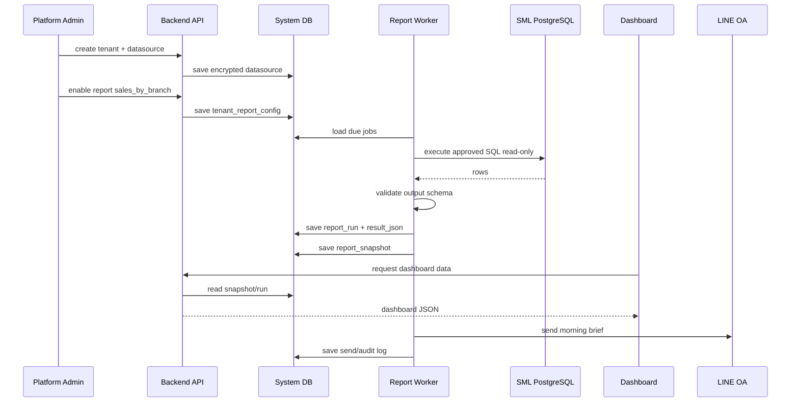
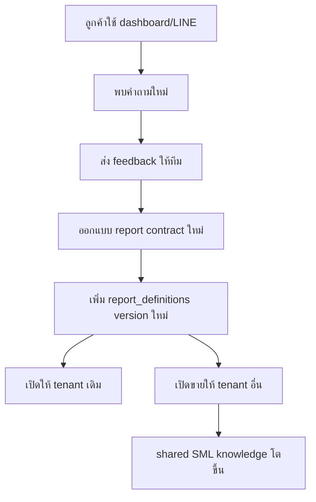

# Data Flow

## เป้าหมายของเอกสาร

อธิบาย full loop ของข้อมูลตั้งแต่ onboarding tenant, connect SML database, run report, build snapshot, dashboard, LINE Morning Brief, audit และ feedback loop กลับเข้า shared report library

## Full Loop



## Tenant Onboarding Flow

1. สร้าง `tenant`
2. เพิ่ม `datasource`
3. ทดสอบ connection
4. scan schema หรือ fingerprint เบื้องต้น
5. enable report ที่ต้องใช้
6. ตั้ง schedule
7. ตั้ง LINE target
8. run manual ครั้งแรก
9. ตรวจ dashboard และตัวเลขกับลูกค้า
10. เปิด scheduled job

## Report Run Flow

```text
input:
  tenant_id
  report_key
  params

steps:
  1. validate tenant active
  2. validate subscription allows report
  3. load datasource
  4. decrypt secret in memory only
  5. validate params
  6. render approved SQL template
  7. execute with timeout
  8. validate output schema
  9. save report_run
  10. build report_snapshot
  11. write audit log
```

## Dashboard Data Flow

Dashboard ไม่ควรรัน SML query โดยตรงทุก request

Preferred:

```text
Dashboard
  -> Backend API
  -> report_snapshots / report_runs
```

Manual refresh:

```text
Dashboard
  -> API trigger report run
  -> Worker run query
  -> save new snapshot
  -> Dashboard reload
```

## LINE Morning Brief Flow

```text
08:00 Asia/Bangkok
  -> scheduler selects active tenant reports
  -> run or read latest sales snapshot
  -> render message from summary_json
  -> send LINE OA
  -> save send result
  -> alert if failed
```

## Feedback Loop



## Data Freshness Rules

ทุก dashboard ควรแสดง:

- `last_run_at`
- `period_from`
- `period_to`
- `status`
- `row_count`
- `source_report_key`

สถานะ:

- `synced`: รันสำเร็จและข้อมูลยังสด
- `stale`: ข้อมูลเกิน freshness threshold
- `failed`: run ล่าสุดล้มเหลว
- `partial`: มีบาง report สำเร็จ บาง report ล้มเหลว

## Failure Handling

กรณีที่ต้องรองรับ:

- SML DB connect ไม่ได้
- query timeout
- output column ไม่ตรง contract
- LINE API fail
- datasource credential ผิด
- tenant subscription inactive

ทุกกรณีต้องเขียน `report_runs.status` หรือ audit log เพื่อ debug ได้

