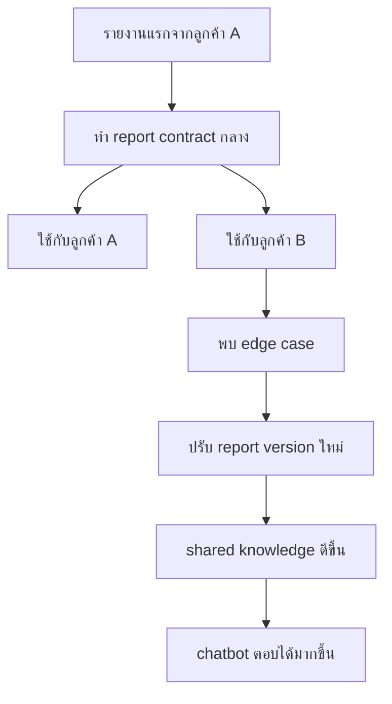

# SML Knowledge Model

## เป้าหมายของเอกสาร

นิยาม shared SML knowledge ที่ใช้ร่วมกันทุก tenant เพื่อให้ report library และ future chatbot เข้าใจ SML ในภาษาธุรกิจเดียวกัน

## Core Idea

SML แต่ละร้านคาดว่าจะมี schema เหมือนกันหรือใกล้เคียงกันมาก ดังนั้นระบบควรสร้าง knowledge กลาง:

```text
SML tables/fields
  -> business objects
  -> metric definitions
  -> report library
  -> chatbot intents
```

ข้อมูลจริงยังแยกตาม tenant database

## Knowledge Layers

### 1. Schema Dictionary

เก็บความหมายของ table/field ใน SML

ตัวอย่าง:

```text
doc_date = วันที่เอกสาร
doc_no = เลขที่เอกสาร
branch_code = รหัสสาขา
item_code = รหัสสินค้า
qty = จำนวน
net_amount = ยอดสุทธิ
```

Phase 1 ยังไม่ต้อง scan ทุก table อัตโนมัติ แต่ควรเริ่มบันทึก field จาก query แรก

### 2. Business Object Model

แปลง SML data เป็น object ภาษาธุรกิจ:

```text
Branch
Product
SalesDocument
SalesLine
Customer
AccountReceivable
StockBalance
Salesperson
```

Phase 1 ใช้:

- `Branch`
- `Product`
- `SalesLine`

### 3. Metric Definitions

นิยามตัวเลขให้เหมือนกันทุก tenant

ตัวอย่าง:

```text
gross_sales = ยอดขายก่อนหักส่วนลด/คืนสินค้า ตาม query definition
net_sales = ยอดขายสุทธิที่ใช้ใน dashboard
total_qty = จำนวนขายรวม
top_product = สินค้าที่มียอดขายสูงสุดตาม net_sales
branch_sales = ยอดขายรวมตาม branch_code
```

ข้อควรระวัง:

- ต้องนิยามว่าจะนับเอกสารประเภทไหน
- ต้องนิยามว่าจะรวม/ไม่รวม VAT
- ต้องนิยามการคืนสินค้าและส่วนลด
- ต้องนิยามช่วงวันที่ให้ตรงกับ SML report เดิม

### 4. Report Library

รายงานกลางที่เพิ่มขึ้นเรื่อย ๆ:

```text
sales_goods_services
sales_by_branch
sales_by_product
top_products
sales_daily_trend
sales_by_customer
sales_by_salesperson
ar_overdue
so_backlog
inventory_risk
```

Phase 1 implementation เริ่มจริงที่ `sales_goods_services` เพราะ query แรกจาก SML เป็นรายงานขายสินค้าและบริการที่ให้ทั้งหัวบิล, รายการสินค้า, สาขา, สินค้าขายดี และใช้ต่อยอดเป็น sales summary ได้

### 5. Chatbot Intent Model

อนาคต chatbot map คำถามเป็น intent:

```text
ถามยอดขายเมื่อวาน -> sales_summary -> sales_goods_services
ถามสินค้าขายดี -> top_products -> sales_goods_services/sales_by_product
ถามสาขาไหนขายดีที่สุด -> branch_sales -> sales_goods_services/sales_by_branch
```

## Branch Handling

บางร้านมี `branch_code` บางร้านไม่มี

ระบบต้องรองรับ:

```text
has_branch_code:
  แสดงยอดตามสาขา

single_branch:
  แสดงเป็น "สำนักงานใหญ่" หรือ company total

unknown:
  แสดงรวมก่อน และรอ mapping
```

`branch_code` ไม่ควรเป็น required field สำหรับทุก tenant แต่ถ้ามีควรใช้เป็น dimension หลัก

## Shared vs Tenant-Specific

### Shared

- report definitions
- metric definitions
- SQL template baseline
- output schema
- LINE summary template
- chatbot intent mapping

### Tenant-Specific

- DB connection
- branch mapping/name
- enabled reports
- schedule
- LINE target
- permission
- report results

## Knowledge Growth Loop



## Explicit Assumptions

- SML schema baseline เหมือนกันมากพอที่จะใช้ report library กลางได้
- ถ้ามี tenant ที่ schema ต่าง ค่อยเพิ่ม tenant-specific override ภายหลัง
- chatbot ต้องอ้างอิง report library ไม่ใช่เรียนรู้จาก raw DB schema โดยตรง
