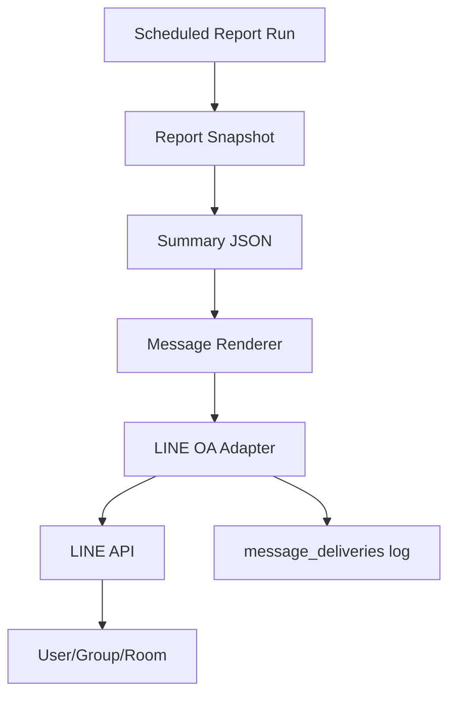

# LINE OA Morning Brief

## เป้าหมายของเอกสาร

ออกแบบ LINE OA strategy สำหรับส่ง Morning Brief ทุกเช้า และรองรับอนาคตเป็น LINE chatbot โดยยังรักษา tenant isolation และ auditability

## Phase 1D Implementation Status

เริ่มมี LINE preview renderer แล้วสำหรับ report แรก `sales_goods_services`

```text
GET /api/reports/:tenantId/sales_goods_services/line-preview
```

หลักการ:

- renderer อ่านจาก `report_snapshots` ล่าสุด
- preview ยังไม่ส่งข้อความจริง
- ข้อความต้องระบุ `source` ว่าเป็น `SML PostgreSQL` หรือ sample
- ต้องใส่ `run_id` เพื่อ trace กลับไปหา report run
- ถ้ามี reconciliation warning ต้องแสดงหมายเหตุใน message

ข้อมูลที่ต้องใช้สำหรับขั้นส่งจริง:

- LINE OA channel access token
- target recipient เช่น `userId`, `groupId`, หรือ `roomId`
- tenant/channel mapping ใน `line_channels`
- send log/retry ใน `message_deliveries`

## LINE OA Strategy

### Demo / Pilot

ใช้ LINE OA ของระบบเราได้ เพื่อ setup เร็วและควบคุม flow ง่าย

เหมาะสำหรับ:

- demo
- pilot internal
- ลูกค้าที่ยังไม่มี OA

### Production

ควรรองรับ LINE OA ของลูกค้าเป็นหลัก

เหตุผล:

- ข้อความออกในชื่อแบรนด์ลูกค้า
- ลูกค้าเป็นเจ้าของ follower/group
- tenant isolation ชัดกว่า
- เหมาะกับ subscription แบบ managed service

ระบบของเราคิดเงินจาก:

- dashboard/report engine
- LINE integration
- scheduled morning brief
- report modules
- chatbot ในอนาคต

## Message Flow



## Schedule

Default:

```text
08:00 Asia/Bangkok
```

ต้อง config ต่อ tenant ได้:

```text
send_time
timezone
enabled_reports
target_id
```

## Morning Brief Content

Phase 1 template example:

```text
สรุปยอดขายประจำวันที่ {{period_date}}

ยอดขายรวม: {{total_net_amount}} บาท
จำนวนสินค้า: {{total_qty}} ชิ้น

ยอดขายตามสาขา:
{{branch_summary_top_5}}

สินค้าขายดี:
{{top_products_top_5}}

ข้อมูลล่าสุด: {{last_run_at}}
ดู Dashboard: {{dashboard_url}}
```

ถ้า tenant ไม่มีสาขา:

```text
สรุปยอดขายประจำวันที่ {{period_date}}

ยอดขายรวม: {{total_net_amount}} บาท
จำนวนสินค้า: {{total_qty}} ชิ้น

สินค้าขายดี:
{{top_products_top_5}}

ข้อมูลล่าสุด: {{last_run_at}}
```

## Message Renderer Rules

- format ตัวเลขเป็นเงินบาท/จำนวน
- แสดงช่วงวันที่เสมอ
- แสดง `last_run_at`
- ถ้าไม่มีข้อมูล ให้ส่งข้อความแบบ empty state ไม่ใช่ error ดิบ
- ถ้า report failed ให้ส่ง alert เฉพาะ admin target หรือบันทึก error ตาม config

## Retry Policy

ขั้นต่ำ:

- retry 3 ครั้ง
- backoff 1 นาที, 5 นาที, 15 นาที
- ถ้ายัง fail ให้บันทึก `message_deliveries.status = failed`

## Audit

ทุกการส่งต้องเก็บ:

```text
tenant_id
report_run_id
target_id
message_type
status
sent_at
provider_response
error_message
```

## Phase 1E Implementation Status

เพิ่ม safe LINE test sender แล้ว:

- `GET /api/reports/:tenantId/sales_goods_services/line-deliveries`
- `POST /api/reports/:tenantId/sales_goods_services/line-send-test`

request body:

```json
{ "mode": "dry_run" }
```

หรือ:

```json
{ "mode": "send" }
```

behavior:

- `dry_run`: render message, create `line_deliveries`, append audit log, ไม่ส่งออก LINE
- `send` + env ครบ: push text message ไป LINE Messaging API
- `send` + env ไม่ครบ: mark เป็น `skipped` และไม่ส่งออก
- response และ audit log ห้าม expose token หรือ target id เต็ม ใช้ masked target เท่านั้น

env:

```text
LINE_DEMO_CHANNEL_ACCESS_TOKEN=
LINE_DEMO_TARGET_ID=
LINE_OFFICE_CHANNEL_ACCESS_TOKEN=
LINE_OFFICE_TARGET_ID=
```

สำหรับ demo สามารถใช้ fallback กลางได้:

```text
LINE_CHANNEL_ACCESS_TOKEN=
LINE_TARGET_ID=
```

แต่ production ควรใช้ tenant-specific config เพื่อรักษา tenant/channel isolation

## Tenant Isolation

- `line_channels` ต้องผูกกับ `tenant_id`
- access token ต้อง encrypted
- ห้ามใช้ target/group ข้าม tenant
- future webhook inbound ต้อง resolve tenant จาก channel id หรือ mapping ที่ชัดเจน

## Future Chatbot

LINE inbound ในอนาคต:

```text
LINE webhook
  -> resolve tenant/channel/user
  -> permission check
  -> intent router
  -> approved report
  -> response renderer
  -> LINE reply
```

Phase 1 ยังไม่เปิด inbound chatbot
