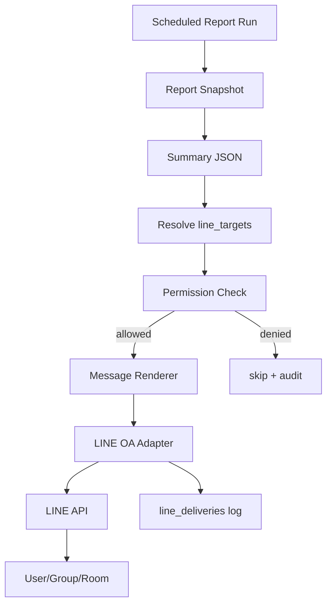

# LINE OA Morning Brief

## เป้าหมายของเอกสาร

ออกแบบ LINE OA strategy สำหรับส่ง Morning Brief ทุกเช้า และรองรับอนาคตเป็น LINE chatbot โดยยังรักษา tenant isolation และ auditability

## Current Implementation Status

สถานะล่าสุดวันที่ `2026-05-20`: LINE Morning Brief สำหรับ report แรก `sales_goods_services` ใช้งานแบบ professional pilot แล้ว

```text
GET /api/reports/:tenantId/sales_goods_services/line-preview
GET /api/reports/:tenantId/sales_goods_services/line-deliveries
POST /api/reports/:tenantId/sales_goods_services/line-send-test
POST /api/reports/:tenantId/sales_goods_services/morning-brief/run-and-send
GET /api/owner/line-channels
POST /api/owner/line-channels
GET /api/line-targets?tenant_id=...
POST /api/line-targets/:id/approve
PATCH /api/line-targets/:id
POST /api/line-targets/:id/test-send
```

หลักการ:

- renderer อ่านจาก `report_snapshots` ล่าสุด หรือ snapshot ที่เพิ่ง run ใน morning brief flow
- `line-preview` ไม่ส่งข้อความจริง
- `line-send-test` และ `morning-brief/run-and-send` เป็น mutation endpoint ต้องใช้ `x-ai-bcc-admin-token`
- `line_targets` แยกสิทธิ์ระดับกลุ่ม/room/user ต่อ tenant แล้ว โดยเริ่มจาก profile `executive`, `sales_manager`, `operations`, `staff`
- live send ใช้ LINE Flex Message เป็น default และเก็บ text summary เป็น fallback/preview
- ข้อความต้องระบุ source เป็นภาษาผู้ใช้ เช่น `ข้อมูลจากระบบขาย SML`
- `run_id` ต้อง trace ได้ผ่าน viewer/details และ `line_deliveries` แต่ไม่ต้องโชว์ในข้อความ LINE ส่วนหลัก
- ถ้ามี reconciliation warning ต้องแสดงเป็นหมายเหตุหรือ insight ที่อ่านรู้เรื่อง
- dashboard link ใน LINE ต้องเป็น signed report viewer URL ไม่ใช่ admin dashboard
- signed URL ต้องอยู่หลังปุ่ม `เปิดรายงาน` ไม่แสดง URL ยาวใน body หลัก
- signed viewer URL ห้าม log หรือบันทึกเต็มใน docs เพราะมี token
- target ใหม่ที่พบจาก webhook จะถูกเก็บเป็น pending (`approved=false`, `enabled=false`) ไม่ auto-enable เพื่อกันส่งข้อมูลผิดกลุ่ม
- LINE target ต้องมาจาก target registry/webhook ที่ admin อนุมัติแล้ว; env fallback target ปิดเป็นค่า default เพื่อกันกลุ่มเก่าถูกสร้างกลับมาทุก restart
- tenant ที่เป็น `suspended` หรือ `cancelled` จะไม่ส่ง Morning Brief แม้ target จะ approved แล้ว
- Owner Admin เริ่มมี `line_channels` registry เพื่อรองรับหลาย LINE OA ต่อ tenant: 1 tenant มีหลาย OA, 1 OA มีหลาย target
- web public URL ใช้ same-origin `/api` rewrite ไปยัง API ภายใน Docker เพื่อลดการพึ่งพา API quick tunnel แยกอีกตัว
- ระบบพยายามดึงชื่อกลุ่มจาก LINE group summary API เพื่อให้ admin เห็นชื่อกลุ่มแทน masked group id ถ้า LINE API ให้สิทธิ์และ OA ยังอยู่ในกลุ่มนั้น

ข้อมูลที่ต้องใช้สำหรับการส่งจริง:

- LINE OA channel access token
- target recipient เช่น `userId`, `groupId`, หรือ `roomId`
- tenant/channel mapping ใน `line_channels`
- send log/retry ใน `line_deliveries`

หมายเหตุ production:

- Phase ปัจจุบัน `line_channels` เก็บ metadata และสถานะ configured ก่อน ยังไม่เก็บ token จริงใน DB
- Production ต้องเพิ่ม encrypted secret store สำหรับ `channel_access_token` และ `channel_secret`
- Webhook หลาย LINE OA ควรมี route หรือ channel mapping ที่ระบุได้ว่า event มาจาก channel ใด ก่อน auto-map target เข้าช่องทางนั้น

## LINE OA Strategy

### Demo / Pilot

ใช้ LINE OA ของระบบเราได้ เพื่อ setup เร็วและควบคุม flow ง่าย

เหมาะสำหรับ:

- demo
- pilot internal
- ลูกค้าที่ยังไม่มี OA

### Production

ควรรองรับ LINE OA ของลูกค้าเป็นหลัก

เหตุผล:

- ข้อความออกในชื่อแบรนด์ลูกค้า
- ลูกค้าเป็นเจ้าของ follower/group
- tenant isolation ชัดกว่า
- เหมาะกับ subscription แบบ managed service

ระบบของเราคิดเงินจาก:

- dashboard/report engine
- LINE integration
- scheduled morning brief
- report modules
- chatbot ในอนาคต

## Message Flow



## Schedule

Default:

```text
08:00 Asia/Bangkok
```

Current pilot:

```text
MORNING_BRIEF_ENABLED=true
MORNING_BRIEF_TENANT_IDS=tenant_demo_remote
MORNING_BRIEF_TIME=08:00
MORNING_BRIEF_TIMEZONE=Asia/Bangkok
MORNING_BRIEF_MODE=send
```

Period:

```text
period = yesterday
```

ตัวอย่าง:

- ถ้าวันนี้คือ `2026-05-20`
- report period ที่ส่งคือ `2026-05-19` ถึง `2026-05-19`

ต้อง config ต่อ tenant ได้:

```text
send_time
timezone
enabled_reports
target_id
```

ปัจจุบัน scheduler จะส่งไปทุก `line_targets` ที่:

- `tenant_id` ตรงกับ report
- `approved=true`
- `enabled=true`
- มี `receive_morning_brief` ใน `allowed_actions`
- มี `sales_goods_services` ใน `allowed_report_keys`

ถ้า target ไม่มีสิทธิ์ ระบบต้อง skip และบันทึก audit โดยไม่ส่งข้อมูลธุรกิจ

Admin onboarding flow สำหรับกลุ่มใหม่:

```text
1. เพิ่ม LINE OA เข้ากลุ่ม
2. พิมพ์ test ในกลุ่ม
3. กลับมาที่ /command-center/settings แล้วกดรีเฟรช
4. ตรวจชื่อกลุ่ม/รหัสปลายทาง masked
5. กดอนุมัติผู้บริหารหรือเลือก profile ที่เหมาะสม
6. กดส่งทดสอบเฉพาะกลุ่มนั้น
```

## Morning Brief Content

Current professional pilot template ใช้ LINE Flex bubble:

```text
รายงานขายสินค้าและบริการ

บริษัท: {{tenant_name}}
วันที่ข้อมูล: {{period_date}}
อัปเดต: {{generated_at}}

ยอดขายสุทธิ: {{total_sales}} บาท
บิลขาย: {{document_count}} ใบ
จำนวนรายการขาย: {{line_count}} รายการ
จำนวนขายรวม: {{total_qty}}

วันนี้ควรรู้อะไร
{{business_insight}}

เทียบยอด
{{comparison_summary_if_any}}

ยอดหลัก
{{top_branch}}

สินค้าขายดี
{{top_product}}

[เปิดรายงาน]
```

ข้อความ fallback สำหรับ preview/log/dry-run ต้องไม่ใส่ชื่อ OA ซ้ำบรรทัดแรก และไม่แสดง signed URL เต็ม ถ้าส่งแบบ Flex สำเร็จให้บอกเพียงว่า `เปิดรายงาน: กดปุ่มใน LINE เพื่อดูรายละเอียด`

Empty-state policy สำหรับวันที่ยอดขายเป็น `0`:

- ใช้ Flex bubble แบบ hybrid empty-state report card ไม่ใช่ checklist/error card
- คงโครงรายงาน: KPI, `วันนี้ควรรู้อะไร`, `เทียบยอด`, `ยอดขายตามสาขา`, `สินค้าขายดี`, และปุ่ม `เปิดรายงาน`
- แสดง empty summary แบบเบา ๆ เช่น `ไม่มีข้อมูลสำหรับช่วงวันที่นี้` เพื่อให้ยังรู้สึกว่าเป็นรายงานขาย
- ไม่ใช้ wording แบบ alarm เช่น `ลดลง -100%` ใน bubble; ให้ใช้ข้อมูลอ้างอิงแบบนุ่ม เช่น `ต่ำกว่าวันก่อนหน้า ซึ่งมียอดขาย ...`
- ลดคำซ้ำ เช่น `ยังไม่มีข้อมูลสาขา`, `ยังไม่มีสินค้า`, `ไม่พบยอดขาย` ไม่ควรซ้อนกันหลายบรรทัดใน bubble เดียว

Multi-report policy เมื่อมีรายงานเพิ่ม:

- Morning Brief ห้ามต่อทุก report แบบเต็ม ๆ จนข้อความยาวขึ้นเรื่อย ๆ
- LINE ควรเป็น executive digest: 1 bubble หลักหรือ carousel สั้น ๆ ที่เลือกเฉพาะ 3-5 สัญญาณสำคัญที่สุดของวัน
- แต่ละ report ต้องมี contract ของตัวเองและสร้าง `line_summary` แบบสั้น ไม่เกิน 1 KPI + 1 insight + 1 CTA
- รายละเอียดเต็มให้ไปอยู่ใน `/command-center/brief` หรือ report viewer แยกรายงาน ไม่ใช่ใน LINE chat
- ถ้ามีหลาย report ในวันเดียว ให้เรียงตาม severity/business impact เช่น ยอดขายผิดปกติ, AR overdue, stock risk, SO backlog

ถ้า tenant ไม่มีสาขา:

```text
สรุปยอดขายประจำวันที่ {{period_date}}

ยอดขายรวม: {{total_net_amount}} บาท
จำนวนสินค้า: {{total_qty}} ชิ้น

สินค้าขายดี:
{{top_products_top_5}}

ข้อมูลล่าสุด: {{last_run_at}}
```

## Message Renderer Rules

- format ตัวเลขเป็นเงินบาท/จำนวน
- แสดงช่วงวันที่เสมอ
- แสดง `last_run_at`
- ถ้าไม่มีข้อมูล ให้ส่งข้อความแบบ empty state ไม่ใช่ error ดิบ
- ถ้า report failed ให้ส่ง alert เฉพาะ admin target หรือบันทึก error ตาม config
- ใช้คำที่ผู้บริหารอ่านรู้เรื่อง เช่น `จำนวนรายการขาย`, `ข้อมูลจากระบบขาย SML`
- หลีกเลี่ยงคำ technical เช่น `SML PostgreSQL`, `Dashboard`, `line_count` ในข้อความ LINE
- link ต้องเปิด `/command-center/brief` ที่ validate signed token ได้
- Flex Message ต้องมี `altText` สั้นและไม่มี signed token เต็ม
- URI action ของปุ่ม `เปิดรายงาน` ต้องเป็น http(s) และผ่าน guard ความยาว ไม่เช่นนั้น fallback เป็น text message
- audit/log เก็บ `message_type = flex | text` และห้ามเก็บ signed token เต็ม

## Retry Policy

ขั้นต่ำ:

- retry 3 ครั้ง
- backoff 1 นาที, 5 นาที, 15 นาที
- ถ้ายัง fail ให้บันทึก `line_deliveries.status = failed`

## Audit

ทุกการส่งต้องเก็บ:

```text
tenant_id
report_run_id
target_id
message_type
status
sent_at
provider_response
error_message
```

## Phase 1E Historical Implementation Status

เพิ่ม safe LINE test sender แล้ว:

- `GET /api/reports/:tenantId/sales_goods_services/line-deliveries`
- `POST /api/reports/:tenantId/sales_goods_services/line-send-test`

request body:

```json
{ "mode": "dry_run" }
```

หรือ:

```json
{ "mode": "send" }
```

behavior:

- `dry_run`: render message, create `line_deliveries`, append audit log, ไม่ส่งออก LINE
- `send` + env ครบ: push Flex Message ไป LINE Messaging API ถ้า signed URL พร้อม ไม่เช่นนั้น push text fallback
- `send` + env ไม่ครบ: mark เป็น `skipped` และไม่ส่งออก
- response และ audit log ห้าม expose token หรือ target id เต็ม ใช้ masked target เท่านั้น

env:

```text
LINE_DEMO_CHANNEL_ACCESS_TOKEN=
LINE_OFFICE_CHANNEL_ACCESS_TOKEN=
```

สำหรับ demo/pilot สามารถใช้ channel token กลางได้:

```text
LINE_CHANNEL_ACCESS_TOKEN=
```

ค่า `LINE_TARGET_ID` / `LINE_DEMO_TARGET_ID` เป็น legacy fallback ไม่ควรใช้กับระบบ target registry แล้ว ถ้าจำเป็นต้องเปิด fallback ชั่วคราวต้องตั้ง `LINE_TARGET_ENV_FALLBACK_ENABLED=true` แบบตั้งใจเท่านั้น

## Tenant Isolation

- `line_channels` ต้องผูกกับ `tenant_id`
- `line_targets` ต้องผูกกับ `tenant_id`
- access token ต้อง encrypted
- ห้ามใช้ target/group ข้าม tenant
- future webhook inbound ต้อง resolve tenant จาก channel id หรือ mapping ที่ชัดเจน

## LINE Group Permission Profiles

Phase ปัจจุบันรองรับ group-level permission ก่อน ยังไม่แยกสิทธิ์ราย user ในกลุ่มเดียวกัน

```text
executive
  reports: sales_goods_services
  actions: receive_morning_brief, ask_report, open_signed_viewer

sales_manager
  reports: sales_goods_services
  actions: receive_morning_brief, ask_report, open_signed_viewer

operations
  reports: none for sales in current phase
  future: inventory_risk, so_backlog, stock reports

staff
  reports: none
  behavior: deny business report access with safe message
```

Permission check function ต้องใช้ร่วมกันทั้ง:

- Morning Brief scheduler
- target-specific test send
- signed viewer link generation
- future chatbot intent routing

Future chatbot rule: ทุกคำถามต้อง resolve `tenant_id + line_target + report_key + action` ก่อนเลือก report ถ้า deny ให้ตอบว่า `กลุ่มนี้ไม่มีสิทธิ์ดูรายงานนี้` และห้ามรัน/สรุปข้อมูล

## Future Chatbot

LINE inbound ในอนาคต:

```text
LINE webhook
  -> resolve tenant/channel/user
  -> permission check
  -> intent router
  -> approved report
  -> response renderer
  -> LINE reply
```

Phase 1 ยังไม่เปิด inbound chatbot

## Current Safety Rules

- ไม่ส่ง LINE ซ้ำถ้า delivery key เดิมเคย success แล้ว ยกเว้น `force=true`
- UI ต้อง confirm ก่อนส่ง LINE จริง
- API ต้อง reject mutation ที่ไม่มี admin token:
  - ไม่มี token: `401`
  - token ผิด: `403`
- response และ audit ห้าม expose token หรือ target id เต็ม
- signed viewer link TTL default = `72` ชั่วโมง

## Next Check

รอบถัดไปให้ตรวจ Morning Brief จริงตอน `08:00 Asia/Bangkok`:

1. worker run report ของ `tenant_demo_remote`
2. snapshot period = เมื่อวาน
3. LINE delivery status = `success` หรือถ้า duplicate ต้องเป็น `skipped`
4. link จาก LINE เปิด `/command-center/brief` ของ `run_id` รอบนั้น
5. ไม่มี token เต็มหลุดใน log/audit/browser body
