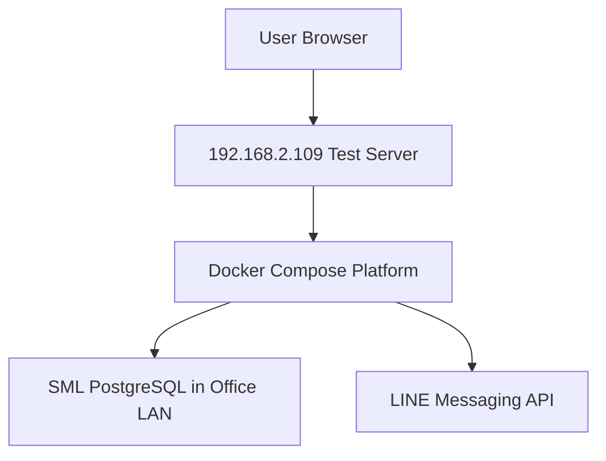

# Tech Stack and Deployment

## เป้าหมายของเอกสาร

กำหนด tech stack และ deployment model สำหรับ MVP ที่เครื่องทดสอบ และต่อยอดสู่ production subscription platform

## Recommended Stack

### Frontend

```text
Next.js
React
Tailwind CSS
Recharts หรือ ECharts
```

ใช้สำหรับ:

- dashboard
- report viewer
- run history
- admin config

### Backend API

```text
Node.js
TypeScript
Fastify
Zod
node-postgres
```

เหตุผล:

- ต่อ PostgreSQL ง่าย
- ทำ API เร็ว
- validate params/output ชัด
- deploy ง่ายบน Docker

### Worker / Scheduler

Option MVP:

```text
Node.js worker + cron
```

Option Production:

```text
BullMQ + Redis
```

ใช้สำหรับ:

- scheduled report runs
- LINE sending
- retry
- background jobs

### System Database

```text
PostgreSQL
```

ใช้เก็บ:

- tenant config
- datasource
- report definitions
- report runs
- snapshots
- audit

Phase 1B implementation ใช้ `SystemStore` abstraction:

- development default: `.data/system-store.json`
- production/staging: `SYSTEM_DATABASE_URL` ไปยัง PostgreSQL system DB

ข้อกำหนด:

- `.data/` ต้องไม่ commit เข้า git
- production ต้องใช้ PostgreSQL system DB ไม่ใช้ local JSON
- system DB ต้องแยกจาก SML customer database
- SML datasource credential ยังอยู่ใน env/secret manager ไม่เก็บใน `report_snapshots`

### ORM / DB Layer

Recommended:

```text
Drizzle ORM
```

Alternative:

```text
Prisma
```

เหตุผลที่เริ่มด้วย Drizzle:

- schema explicit
- TypeScript friendly
- migration คุมง่าย
- เบากว่า Prisma สำหรับ worker/API

### LINE OA

ใช้ LINE Messaging API ผ่าน backend adapter

เก็บ token แบบ encrypted ใน system DB หรือ env สำหรับ demo

## Deployment Target: Test Machine

Target:

```text
192.168.2.109
```

Phase 1 deploy ด้วย Docker Compose:

```text
web
api
worker
postgres
redis optional
```

## Docker Compose Shape

```text
services:
  web:
    Next.js dashboard

  api:
    Fastify backend

  worker:
    report scheduler + LINE sender

  postgres:
    system database

  redis:
    optional job queue
```

## Environment Variables

ตัวอย่างชื่อ env:

```text
APP_ENV=development
APP_BASE_URL=http://192.168.2.109:3000
SYSTEM_DATABASE_URL=<SYSTEM_DB_URL>
ENCRYPTION_KEY=<SECRET>
LINE_DEMO_CHANNEL_ACCESS_TOKEN=<SECRET>
DEFAULT_TIMEZONE=Asia/Bangkok
```

ห้าม commit ค่า secret จริง

## Network Model for Pilot



## Development Workflow

1. สร้าง project skeleton
2. สร้าง system DB schema
3. seed tenant/demo datasource/report definition
4. implement report runner
5. implement dashboard API
6. implement dashboard UI
7. implement LINE sender
8. deploy Docker Compose to test machine

## Why Not OpenHuman Desktop in Phase 1

OpenHuman ให้ inspiration ที่ดี แต่ desktop/Tauri/Rust build หนักเกินสำหรับ MVP นี้

Phase 1 ต้องการ:

- web dashboard
- backend report engine
- scheduler
- LINE OA

ดังนั้น web-first stack เร็วและเหมาะกว่า

## Future Production Hardening

- nginx reverse proxy
- HTTPS/domain
- managed PostgreSQL หรือ backup strategy
- Redis for queue
- log aggregation
- error alert
- CI/CD
- staging/prod split
